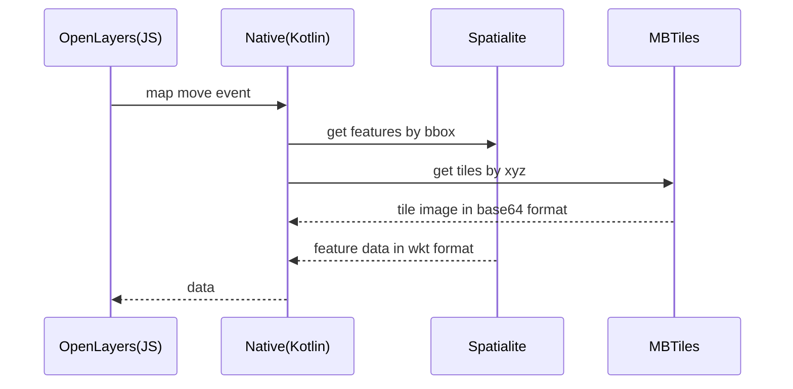

# Spatialite-MBTiles-OpenLayers-Javascript-Kotlin (simple concept of offline map app)

This project aims completely offline mapping scenario. OpenLayers library was preferred due to its rich mapping features. So the project contains both Kotlin and JavaScript source code. Kotlin side and JavaScript side are connected and data flows to each other.

## Data
 **Spatialite** was choosed to store vector data and  **MBTiles** for tile data. These two are highly adopted GIS data formats. You can find sample datasets inside **{project_dir}/app/src/main/assets/gis_data** folder. In this project two vector layers are used: railway, taxi_stands. Keep in mind that; sample datasets increases apk size.

## Kotlin (Native) side

https://github.com/sevar83/android-spatialite library was preferred to enable **Spatialite** features. Note that spatialite layers must have spatial index.

## JavaScript (OpenLayers) side
Project's JS source code for map library is in **{project_dir}/js** folder. You should run **npm i** command inside that folder to install neccessary libs. Also you can run **npm run build** to compile and deploy JS source code. The build will be copied to the **assets/map** folder. 

## Debugging
To debug JS source code, you should enable inline source map. Goto **{project_dir}/js/config** and open **webpack.prod.js** file. Find the **devtool** parameter and change it to **devtool: 'inline-source-map'**. After all run **npm run build**. Now go back to Android Studio and run project. When the app run on mobile device, start Chrome on pc that connected to the mobile device. Goto **chrome://inspect/#devices** address and find WebView title and click inspect!
